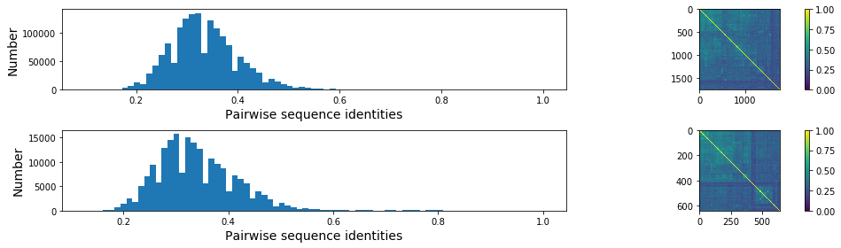
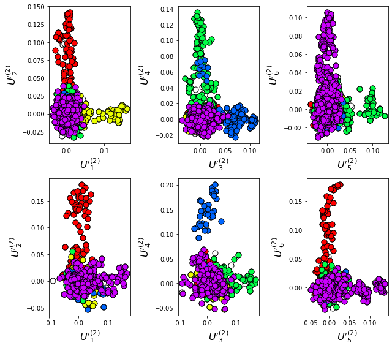
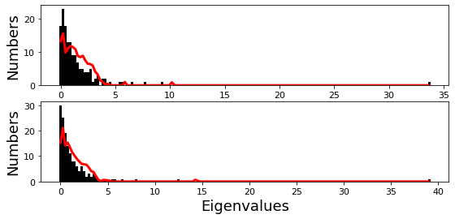
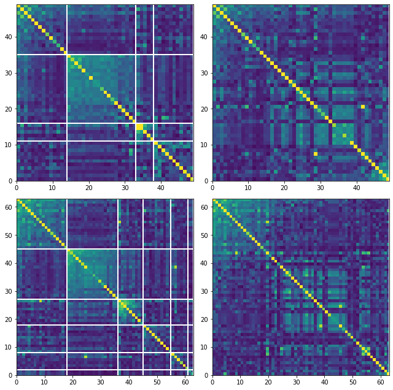
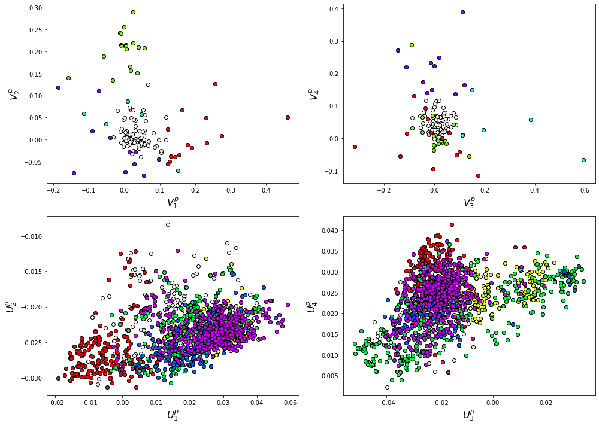
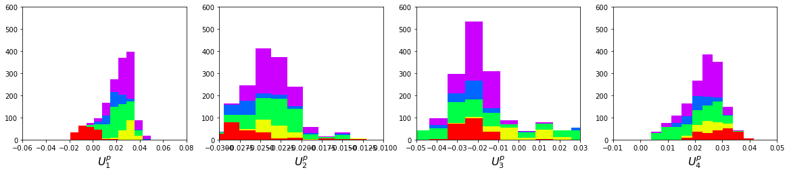

SCA 6.1 - The DHFR (dihydrofolate reductase) family
===================================================

**Summary** This script describes the basic flow of the analytical steps
in SCA6.0, using the DHFR family as an example. Here we compare results
of the analysis for two different alignments: a PFAM alignment (PFAM
PF00186) and an independent manually curated alignment constructed using
a custom database of orthologous sequences (DHFR_PEPM3.an). Despite
differences in the construction, sequence distribution and size of the
two alignments, the sector definition is remarkably consistent: in both
cases we arrive at a single sector assembled from six independent
components.

For this tutorial, the core calculation scripts should be run from the
command line as follows:

::

   >> annotateMSA -i ../data/PF00186_full.txt -o ../outputs/PF00186_full.an -a 'pfam' -p ../data/pfamseq.txt
   >> scaProcessMSA -a ../data/PF00186_full.an -b ../data/ -s 1RX2 -c A -f 'Escherichia coli' -t -n
   >> scaCore -i ../output/PF00186_full.db
   >> scaSectorID -i ../output/PF00186_full.db

   >> annotateMSA -i ../data/DHFR_PEPM3.fasta -o ../output DHFR_PEPM3.an -a 'ncbi' -g ../data/DHFR_PEPM3.gis
   >> scaProcessMSA -a ../data/DHFR_PEPM3.an -b ../data/ -s 1RX2 -c A -t -n
   >> scaCore -i ../output/DHFR_PEPM3.db
   >> scaSectorID -i ../output/DHFR_PEPM3.db

Note that we supply annotated alignments for all tutorial scripts *(the
annotate_pfMSA step is slow, and should only be run once)*.

**O.Rivoire, K.Reynolds and R.Ranganathan** 9/2014

.. code:: python3

    import os
    import time
    import matplotlib.pyplot as plt
    import numpy as np
    import copy
    import colorsys
    import matplotlib.image as mpimg
    from IPython.display import display
    from IPython.display import Image
    import scipy.cluster.hierarchy as sch
    from scipy.stats import scoreatpercentile 
    from pysca import scaTools as sca
    # import mpld3
    import pickle as pickle
    from optparse import OptionParser
    
    %matplotlib inline
    
    if not os.path.exists('../output/'):
        os.makedirs('../output/')  

Read in the results of the above three scripts (scaProcessMSA, scaCore
and scaSectorID), stored as dictionaries in the databases
PF00186_full.db and DHFR_PEPM3.db. To see what variables are stored in
each dictionary, use:

::

   >> print dict.keys()

.. code:: python3

    Dseq = list(); Dsca = list(); Dsect = list()
    db = pickle.load(open('../output/PF00186_full.db','rb'))
    Dseq.append(db['sequence'])
    Dsca.append(db['sca'])
    Dsect.append(db['sector'])
    db2 = pickle.load(open('../output/DHFR_PEPM3.db', 'rb'))
    Dseq.append(db2['sequence'])
    Dsca.append(db2['sca'])
    Dsect.append(db2['sector'])
    N_alg = 2
    AlgName = ['PFAM', 'Manual']

I. Statistical Structure of the Multiple Sequence Alignment (MSA)
~~~~~~~~~~~~~~~~~~~~~~~~~~~~~~~~~~~~~~~~~~~~~~~~~~~~~~~~~~~~~~~~~

We start with a rough comparison of the sequence composition of the two
alignments. Plot a histogram of all pairwise sequence identities *(left
panel)* and a global view of the sequence similarity matrix (defined by
:math:`S\equiv \frac{1}{L}XX^\top`) *(right panel)*. The PFAM alignment
is show in the *top row* and the manual alignment is shown in the
*bottom row*. The manual alignment is smaller (644 seqs vs 2000 for
PFAM), but both alignments are well-described by a nearly homogeneous
distribution of sequence identities with a mean value of about 35%.

.. code:: python3

    ix = 1
    plt.rcParams['figure.figsize'] = 9, 15
    for k in range(N_alg):
        # List all elements above the diagonal (i<j):
        listS = [Dsca[k]['simMat'][i,j] for i in range(Dsca[k]['simMat'].shape[0]) \
                 for j in range(i+1, Dsca[k]['simMat'].shape[1])]
        
        #Cluster the sequence similarity matrix
        Z = sch.linkage(Dsca[k]['simMat'],method = 'complete', metric = 'cityblock')
        R = sch.dendrogram(Z,no_plot = True)
        ind = R['leaves']
        
        #Plotting
        plt.rcParams['figure.figsize'] = 14, 4 
        plt.subplot(2,2,ix)
        ix += 1
        plt.hist(listS, int(round(Dseq[k]['Npos']/2)))
        plt.xlabel('Pairwise sequence identities', fontsize=14)
        plt.ylabel('Number', fontsize=14)
        plt.subplot(2,2,ix)
        ix += 1
        plt.imshow(Dsca[k]['simMat'][np.ix_(ind,ind)], vmin=0, vmax=1); plt.colorbar();   
        plt.tight_layout()

To examine: (1) sampling differences between the alignments and (2) the
relationship between divergence in *sequence similarity* and *phylogeny*
for both alignments, we plot the top independent components of the
sequence correlation matrix (after sequence weighting), colored by
phylogenetic group. We start by constructing a dictionary of
phylogenetic annotations and checking the representation of sequences in
the top taxonomic levels. The annotations are parsed from the sequence
headers:

.. code:: python3

    for k in range(N_alg):
        print("Alignment: " + AlgName[k])
        
        # Cnstruct a dictionary of phylogenetic groups
        annot = dict()
        for i, h in enumerate(Dseq[k]['hd']):
            hs = h.split('|')
            if (len(hs) == 4):
                annot[hs[0]] = sca.Annot(hs[1], hs[2], hs[3].replace('.',''))
            elif (len(hs) == 3):
                annot[hs[0]] = sca.Annot(hs[0],hs[1], hs[2].replace('.',''))
                
        # Most frequent taxonomic groups:
        atleast = 10
        for level in range(4):
            descr_list = [a.taxo.split(',')[level] for a in annot.values() \
                          if len(a.taxo.split(',')) > level]
            descr_dict = {k:descr_list.count(k) for k in descr_list \
                          if descr_list.count(k)>=atleast}
            print('\n Level %i:' % level)
            print(descr_dict)

.. parsed-literal::

    Alignment: PFAM
    
     Level 0:
    {'Bacteria': 1486, 'Eukaryota': 210, 'Viruses': 37, 'Archaea': 24}
    
     Level 1:
    {'Proteobacteria': 581, 'Metazoa': 81, 'Chlamydiae': 14, 'Fungi': 60, 'Actinobacteria': 173, 'Firmicutes': 467, 'dsDNA viruses': 36, 'Tenericutes': 27, 'Bacteroidetes': 155, 'environmental samples': 24, 'Viridiplantae': 32, 'Fusobacteria': 10, 'Euryarchaeota': 23, 'stramenopiles': 11, 'Alveolata': 12}
    
     Level 2:
    {'Gammaproteobacteria': 317, 'Chordata': 36, 'Chlamydiales': 14, 'Dikarya': 59, 'Betaproteobacteria': 108, 'Actinobacteridae': 161, 'Lactobacillales': 176, 'Clostridia': 147, ' no RNA stage': 36, 'Mollicutes': 27, 'Bacteroidia': 70, 'Negativicutes': 26, 'Alphaproteobacteria': 137, 'Flavobacteriia': 52, 'Sphingobacteriia': 14, 'Arthropoda': 32, 'Deltaproteobacteria': 17, 'Bacillales': 103, 'Cytophagia': 12, 'Fusobacteriales': 10, 'Halobacteria': 21, 'Streptophyta': 24, 'Erysipelotrichi': 15, 'Coriobacteridae': 11}
    
     Level 3:
    {'Enterobacteriales': 78, 'Pseudomonadales': 38, 'Craniata': 32, 'Chlamydiaceae': 14, 'Ascomycota': 49, 'Burkholderiales': 65, 'Actinomycetales': 135, 'Chromatiales': 19, 'Lactobacillaceae': 70, 'Clostridiales': 145, 'Caudovirales': 14, 'Pasteurellales': 16, 'Mycoplasmataceae': 18, 'Bacteroidales': 70, 'Selenomonadales': 26, 'Streptococcaceae': 62, 'Vibrionales': 38, 'Enterococcaceae': 22, 'Rhizobiales': 65, 'Bifidobacteriales': 26, 'Flavobacteriales': 49, 'Rhodobacterales': 26, 'Oceanospirillales': 16, 'Sphingobacteriales': 14, 'Hexapoda': 27, 'Paenibacillaceae': 20, 'Neisseriales': 21, 'Bacillaceae': 52, 'Cytophagales': 12, 'Basidiomycota': 10, 'Halobacteriales': 21, 'Xanthomonadales': 17, 'Alteromonadales': 41, 'Sphingomonadales': 16, 'Legionellales': 10, 'Staphylococcus': 11, 'Embryophyta': 24, 'Thiotrichales': 10, 'Erysipelotrichales': 15, 'Coriobacteriales': 11, 'Caulobacterales': 10}
    Alignment: Manual
    
     Level 0:
    {'cellular organisms': 612}
    
     Level 1:
    {' Eukaryota': 151, ' Bacteria': 461}
    
     Level 2:
    {' Opisthokonta': 137, ' Proteobacteria': 259, ' Bacteroidetes/Chlorobi group': 42, ' Firmicutes': 100, ' Actinobacteria': 42, ' Alveolata': 11}
    
     Level 3:
    {' Fungi': 74, ' Alphaproteobacteria': 69, ' Bacteroidetes': 42, ' Betaproteobacteria': 58, ' Bacilli': 78, ' Metazoa': 62, ' Gammaproteobacteria': 126, ' Actinobacteria': 42, ' Clostridia': 21, ' Apicomplexa': 11}

Based on this, we select taxonomic groups and colors for representation.
Here, we just start by choosing the broadly well-represented groups. To
see a complete color-coding legend, use:

::

   >>> sca.figColors()

.. code:: python3

    phylo = list();
    fam_names = ['Eukaryota', 'Bacteroidetes', 'Firmicutes', \
                 'Actinobacteria', 'Proteobacteria']
    col = (0, 0.18, 0.38, 0.6, 0.8) 
    
    # Legend: Eukaryota = red, Bacteriodetes = yellow, Firmicutes = green,
    # Actinobacteria = blue, Proteobacteria = purple
    for a in range(N_alg):
        phylo_alg = list()
        for i,k in enumerate(fam_names):
            sf = sca.Unit()
            sf.name = fam_names[i].lower()
            sf.col = col[i]
            sf.items = [j for j,q in enumerate(Dseq[a]['hd'])  \
                        if sf.name in q.lower()]
            phylo_alg.append(sf)
        phylo.append(phylo_alg)    

Plot the top six independent components of the sequence correlation
matrix (with sequence weights); color-coded by phylogenetic annotation.
We compare the phylogenetic sampling for the PFAM alignment *(top row)*
and manual alignment\ *(bottom row)*. The data show some very clear
seqeunce distinctions based on phylogeny, and the two alignments seem to
differ somewhat in the sequence divergence captured. In particular, the
eukaryotic sequences *(in red)* seem to form a more distinct group in
the manual alignment than in the PFAM alignment. For the PFAM alignment,
the bacteriodetes *(yellow)* diverge along :math:`U_1`, the
actinobacteria *(blue)* along :math:`U_3`, the firmicutes *(green)*
along :math:`U_4` and :math:`U_5`, and a subset of proteobacteria
*(purple)* along :math:`U_6`. For the manual alignment, the eukaryotes
*(red)* diverge along :math:`U_2` and :math:`U_6`, the actinobacteria
*(blue)* along :math:`U_4`, the firmicutes *(green)* along :math:`U_3`,
and a subset of proteobacteria *(purple)* along :math:`U_5`

.. code:: python3

    plt.rcParams['figure.figsize'] = 9, 8
    ix = 1;
    for a in range(N_alg):
        U = Dsca[a]['Uica'][1]
        pairs = [[2*i,2*i+1] for i in range(3)]
        for k,[k1,k2] in enumerate(pairs):
            plt.subplot(2,3,ix)
            ix += 1
            sca.figUnits(U[:,k1], U[:,k2], phylo[a])
            #sca.figUnits(U[:,k1], U[:,k2], subfam)
            plt.xlabel(r"${U'}^{(2)}_{%i}$"%(k1+1), fontsize=16)
            plt.ylabel(r"${U'}^{(2)}_{%i}$"%(k2+1), fontsize=16)
        plt.tight_layout()

II. SCA…conservation and coevolution
~~~~~~~~~~~~~~~~~~~~~~~~~~~~~~~~~~~~

Plot the eigenspectrum of (1) the SCA positional coevolution matrix
(:math:`\tilde{C_{ij}}`) *(black bars)* and (2) 10 trials of matrix
randomization for comparison. This graph is used to choose the number of
significant eigenmodes. Again, we plot the PFAM alignment in the *top
row* and manual alignment in the *bottom row* for comparison. Overall
the two eigenspectra are remarkably similar: due to small differences in
the signficance cutoff, we define 6 signficant eigenmodes for the PFAM
alignment, and 7 for the manual alignment.

.. code:: python3

    for a in range(N_alg):
        plt.rcParams['figure.figsize'] = 9, 4 
        hist0, bins = np.histogram(Dsca[a]['Lrand'].flatten(), bins=Dseq[a]['Npos'], \
                                   range=(0,Dsect[a]['Lsca'].max()))
        hist1, bins = np.histogram(Dsect[a]['Lsca'], bins=Dseq[a]['Npos'],\
                                   range=(0,Dsect[a]['Lsca'].max()))
        plt.subplot(2,1,a+1)
        plt.bar(bins[:-1], hist1, np.diff(bins),color='k')
        plt.plot(bins[:-1], hist0/Dsca[a]['Ntrials'], 'r', linewidth=3)
        plt.tick_params(labelsize=11)
        plt.xlabel('Eigenvalues', fontsize=18); plt.ylabel('Numbers', fontsize=18);
        print('Number of eigenmodes to keep is %i' %(Dsect[a]['kpos']))
    plt.tight_layout()
    #mpld3.display()

.. parsed-literal::

    Number of eigenmodes to keep is 4
    Number of eigenmodes to keep is 6

To define the positions with significant contributions each of the
independent components (ICs), we make a empirical fit for each IC to the
t-distribution and select positions with greater than a specified cutoff
on the CDF. We choose :math:`p=0.95` as our cutoff. Note that since some
positions might contribute significantly to more than one IC (and
indication of non-independence of ICs), we apply a simple algorithm to
assign such positions to one IC. Specifically, we assign positions to
the IC with which it has the greatest degree of co-evolution.

For brevity, we don’t plot the IC fits below (though we do in the other
tutorial notebooks), but do print the list of positions associated with
each IC for both alignments. Comparing between alignments, we can
already see some distinctions in the residue positions associated to
each component: IC1 is expanded for the manual alignment, ICs2,4+5 are
similar for both alignments, and ICs 3+6 are swapped between the two
alignments.

.. code:: python3

    plt.rcParams['figure.figsize'] = 20, 5 
    for a in range(N_alg):
        print("alignment: "+AlgName[a])
        for n,ipos in enumerate(Dsect[a]['ics']):
            sort_ipos = sorted(ipos.items)
            ats_ipos = ([Dseq[a]['ats'][s] for s in sort_ipos])
            ic_pymol = ('+'.join(ats_ipos))
            print('IC %i is composed of %i positions:' % (n+1,len(ats_ipos)))
            print(ic_pymol + "\n")

.. parsed-literal::

    alignment: PFAM
    IC 1 is composed of 14 positions:
    13+18+23+25+27+32+38+39+55+63+90+107+133+153
    
    IC 2 is composed of 19 positions:
    7+14+15+31+35+42+43+44+46+49+54+57+59+61+94+95+96+113+122
    
    IC 3 is composed of 5 positions:
    21+22+24+52+121
    
    IC 4 is composed of 11 positions:
    6+11+40+47+50+51+53+92+100+111+125
    
    alignment: Manual
    IC 1 is composed of 18 positions:
    13+18+23+25+27+28+32+38+39+51+55+63+71+105+107+121+133+158
    
    IC 2 is composed of 18 positions:
    7+14+15+22+31+35+42+43+44+46+49+54+57+61+94+95+96+113
    
    IC 3 is composed of 9 positions:
    40+47+50+52+53+59+81+100+103
    
    IC 4 is composed of 10 positions:
    6+11+41+45+60+90+92+111+125+126
    
    IC 5 is composed of 6 positions:
    5+21+115+122+123+147
    
    IC 6 is composed of 2 positions:
    144+149
    

To define protein sectors, we examine the structure of the SCA
positional correlation matrix with positions contributing to the top
independent components (ICs) ordered by weight *(left panel)*. Again we
compare the results between the PFAM alignment *(top)* and manual
alignment *(bottom)*. This provides a basis to determine/interpret which
ICs are truly statistically independent (defining an independent sector)
and which represent hierarchical breakdowns of one sector.

For both alignments, it seems that the ICs reflect a hierarchical
break-down of a single sector, as determined by the high degree of
co-evolution in the off-diagonal components (see the dendrogram that
follows). In the *right panels* the ICs are combined and re-ordered by
their contribution to :math:`V_1^p` to better see this.

.. code:: python3

    sectors = list()
    ix = 1
    for a in range(N_alg):
        # plot the SCA positional correlation matrix, ordered by contribution 
        #to the top ICs
        plt.rcParams['figure.figsize'] = 9, 9 
        plt.subplot(2,2,ix); ix +=1;
        plt.imshow(Dsca[a]['Csca'][np.ix_(Dsect[a]['sortedpos'],\
                    Dsect[a]['sortedpos'])],vmin=0, vmax=2,\
                   interpolation='none',aspect='equal',\
                   extent=[0,sum(Dsect[a]['icsize']),0,\
                           sum(Dsect[a]['icsize'])])
        line_index=0
        for i in range(Dsect[a]['kpos']):
            plt.plot([line_index+Dsect[a]['icsize'][i],\
                      line_index+Dsect[a]['icsize'][i]],\
                     [0,sum(Dsect[a]['icsize'])],'w', linewidth = 2)
            plt.plot([0,sum(Dsect[a]['icsize'])],[sum(Dsect[a]['icsize'])\
                            -line_index,sum(Dsect[a]['icsize'])-line_index],\
                     'w', linewidth = 2)
            line_index += Dsect[a]['icsize'][i] 
    
        # combine all the ICs into a single sector and re-sort
        sec_groups = ([k for k in range(Dsect[a]['kpos'])])
        sectors_alg = list()
        s = sca.Unit()
        all_items = list()
        all_Vp = list()
        for i in range(Dsect[a]['kpos']): 
            all_items = all_items+Dsect[a]['ics'][i].items
            tmp1 = Dsect[a]['Vpica'][Dsect[a]['ics'][i].items,:]
            all_Vp = all_Vp + list(tmp1[:,0].T) 
        svals = list(np.argsort(all_Vp)); svals.reverse()  
        s.items = [all_items[i] for i in svals]
        s.col = (1/len(sec_groups))*n
        sectors_alg.append(s)
        sectors.append(sectors_alg)
        
        # plot the re-ordered matrix
        sortpos = list()
        for s in sectors[a]:
            sortpos.extend(s.items)
        plt.subplot(2,2,ix); ix += 1;
        line_index=0
        plt.imshow(Dsca[a]['Csca'][np.ix_(sortpos, sortpos)], \
                   vmin=0, vmax=2,interpolation='none',aspect='equal',\
               extent=[0,len(sortpos),0,len(sortpos)])
        for s in sectors[a]:
            plt.plot([line_index+len(s.items),line_index+len(s.items)],\
                     [0,len(sortpos)],'w', linewidth = 2)
            plt.plot([0,sum(Dsect[a]['icsize'])],[len(sortpos)-line_index, \
                            len(sortpos)-line_index],'w', linewidth = 2)
            line_index += len(s.items)
        plt.tight_layout()

The below dendrogram diagrams the relationship between independent
components for the PFAM alignment (the tree for the manual alignment is
similar). In this plot, solid lines represent physically contiguous
structural units, and dashed lines indicate spatially fragmented groups
of residues.

.. code:: python3

    i = Image(filename='../figs/DHFR_sec_hier.png'); i

.. image:: _static/SCA_DHFR_22_0.png

Print the sector positions (as defined for each alignment), in a format
suitable for pyMol, and create two pyMol sessions with the sectors (and
decomposition into independent components) as seperate objects.

.. code:: python3

    for a in range(N_alg):
        print("Alignment: " + AlgName[a])
        for i,k in enumerate(sectors[a]):
            sort_ipos = sorted(k.items)
            ats_ipos = ([Dseq[a]['ats'][s] for s in sort_ipos])
            ic_pymol = ('+'.join(ats_ipos))
            print('Sector %i is composed of %i positions:' % (i+1,len(ats_ipos)))
            print(ic_pymol + "\n")
            
    sca.writePymol('1RX2', sectors[0], Dsect[0]['ics'], Dseq[0]['ats'],\
                   '../output/PF00186.pml','A', '../data/', 0)  
    sca.writePymol('1RX2', sectors[1], Dsect[1]['ics'], Dseq[1]['ats'],\
                   '../output/DHFR_PEPM3.pml','A', '../data/', 0)  

.. parsed-literal::

    Alignment: PFAM
    Sector 1 is composed of 49 positions:
    6+7+11+13+14+15+18+21+22+23+24+25+27+31+32+35+38+39+40+42+43+44+46+47+49+50+51+52+53+54+55+57+59+61+63+90+92+94+95+96+100+107+111+113+121+122+125+133+153
    
    Alignment: Manual
    Sector 1 is composed of 63 positions:
    5+6+7+11+13+14+15+18+21+22+23+25+27+28+31+32+35+38+39+40+41+42+43+44+45+46+47+49+50+51+52+53+54+55+57+59+60+61+63+71+81+90+92+94+95+96+100+103+105+107+111+113+115+121+122+123+125+126+133+144+147+149+158
    

As is evident from the position lists above, and as shown below, the
structural pattern of the two sectors and their associated decomposition
into independent components is highly similar when compared between the
two alignments. The main difference is that the sector (and independent
components) for the manual alignment systematically includes a few more
residue postions.

.. code:: python3

    i = Image(filename='../figs/DHFR_decompv2.png'); i

.. image:: _static/SCA_DHFR_26_0.png

III. The phylogenetic basis of the sector hierarchy
~~~~~~~~~~~~~~~~~~~~~~~~~~~~~~~~~~~~~~~~~~~~~~~~~~~

How does the clear phylogenetic heterogeneity in the MSA influence the
sector definitions? Since the sector definitions for the two alignments
above are roughly equivalent, we only consider the larger (PFAM)
alignment here. To address this, we take advantage of mathematical
methods for mapping between the space of positional and sequence
correlations, as described in *Rivoire et al*. Using this mapping, we
plot the top :math:`k_{pos}` ICs as 2-D scatter plots with the
corresponding sequence space divergence.

.. code:: python3

    plt.rcParams['figure.figsize'] = 14, 10 
    pairs = [ [x, x+1] for x in range(0, len(Dsect[0]['ics'])-1, 2) ]
    for n,[k1,k2] in enumerate(pairs):
        plt.subplot(2,len(pairs),n+1)
        sca.figUnits(Dsect[0]['Vpica'][:,k1], Dsect[0]['Vpica'][:,k2],\
                     Dsect[0]['ics'], dotsize = 6)
        plt.xlabel(r'$V^p_{%i}$' % (k1+1), fontsize=16)
        plt.ylabel(r'$V^p_{%i}$' % (k2+1), fontsize=16)
        plt.subplot(2,len(pairs),n+1+len(pairs))
        sca.figUnits(Dsect[0]['Upica'][:,k1], Dsect[0]['Upica'][:,k2],\
                     phylo[0], dotsize = 6)
        plt.xlabel(r'$U^p_{%i}$' % (k1+1), fontsize=16)
        plt.ylabel(r'$U^p_{%i}$' % (k2+1), fontsize=16)
    plt.tight_layout()

.. code:: python3

    plt.rcParams['figure.figsize'] = 20,8 
    col = list()
    axis_lims = ([-0.06, 0.08],[-0.03, -0.01],[-0.05,0.03],[-0.01 ,0.05],\
                 [-0.02 ,0.05],[-0.05 ,0.03])
    for k in phylo[0]:
        col = col + [colorsys.hsv_to_rgb(k.col,1,1)]
    for k in range(Dsect[0]['kpos']):
        forhist = list()
        for group in phylo[0]:
            forhist.append([Dsect[0]['Upica'][i,k] for i in group.items])
        plt.subplot(2,Dsect[0]['kpos'],k+1)
        plt.hist(forhist, histtype='barstacked',color=col)
        plt.axis([axis_lims[k][0],axis_lims[k][1],0,600])
        plt.xlabel(r'$U^p_{%i}$' % (k+1), fontsize=16)
    plt.tight_layout()

We see some association of phylogeny with sector positions at the phylum
level: for example the positions along :math:`V_3^p` are associated with
the divergence of some bacteriodetes *(yellow)* and
firmicutes\ *(green)* along :math:`U_3^p`. Further, the positions along
ICs :math:`V_1^p`,\ :math:`V_5^p` and :math:`V_6^p` seem to seperate the
eukaryotes *(red)* from the prokaryotes.

So in conclusion, the DHFR family appears to have a single sector that
can be decomposed into roughly six groups due to sequence divergence.
Notably, the sector definition (and decomposition into ICs) is very
similar for the two different sequence alignments.
