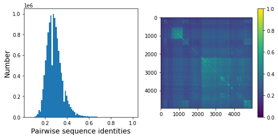
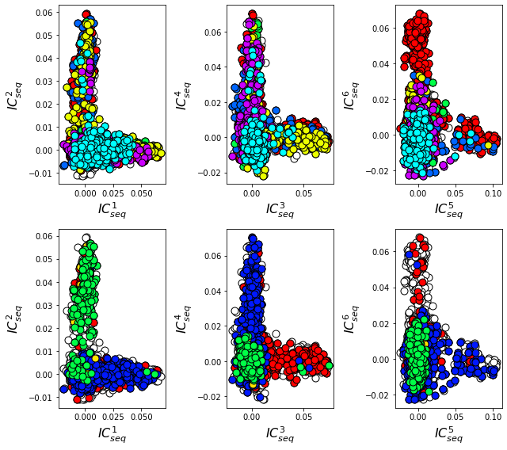
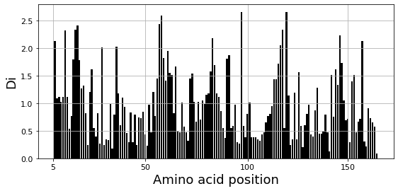
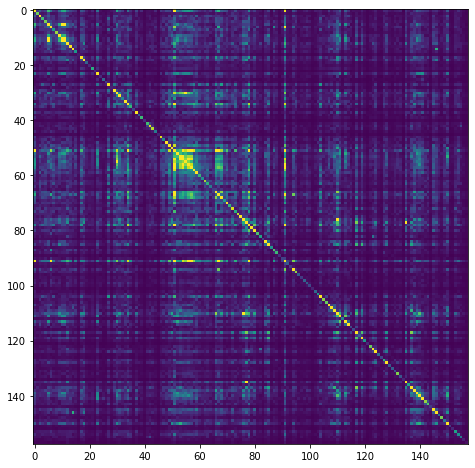
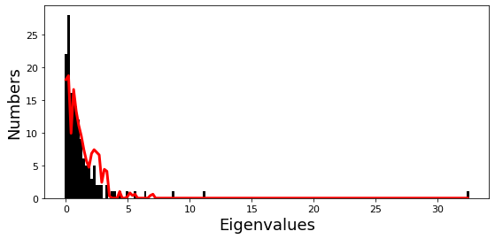
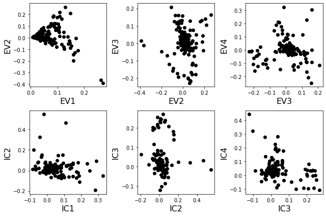
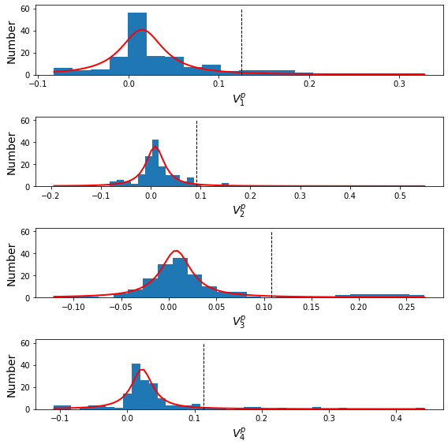
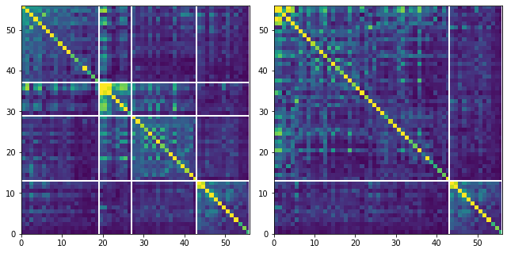
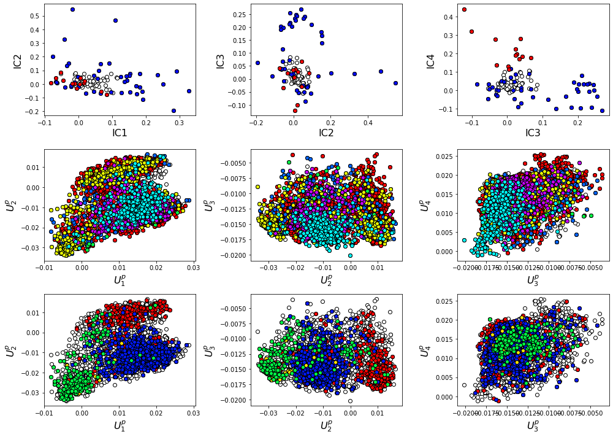
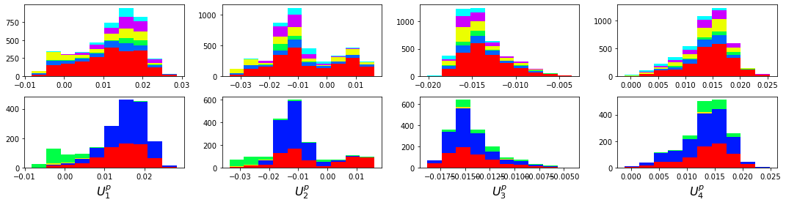

SCA 6.1 - The G Protein Family
==============================

**Summary:** This script describes the basic flow of analytical steps in
SCA6.0, using the G-protein (small GTPase, Ras-like) family as an
example (PFAM PF00071). The analysis consists of five steps, which
directly follow from the accompanying publication (Rivoire et al, “An
Evolution-Based Functional Decomposition of Natural Proteins”):

**1) Alignment processing and composition.** We begin by analyzing the
composition of the mulitple sequence alignment: what is the number of
effective sequences, and how are the sequences structured into families?
For the G-protein family, the PFAM alignment sequence space is
well-sampled and fairly homogeneous (unstructured), as evidenced by the
fact that overall alignment sequence similarity shows a unimodal
distribution near 25%.

**2) First-order statistics: position-specific conservation.** Next, we
examine overall positional conservation for the sequence alignment. This
shows the expected result, that a handful of positions are strongly
conserved.

**3) Second-order statistics: conserved correlations.** Plots of the SCA
matrix (:math:`\tilde{C_{ij}}`), the associated eigenvectors and
eigenspectrum, and the corresponding independent components (IC). We
choose the number of significant eigenmodes, :math:`k^* = 4`, by
comparison of the eigenspectrum of :math:`\tilde{C_{ij}}` to that for a
collection of 10 randomized alignments.

**4) Sector decomposition.** Sector definition based on the top
:math:`k^*` ICs. We begin by fitting the top :math:`k^*` statistically
significant ICs to a t-distribution, and then identify the amino acid
positions contributing to the top five percent of the corresponding
cumulative density function. We then construct a sub-matrix of
:math:`\tilde{C_{ij}}` that contains only the selected top-scoring
positions for the :math:`k^*` ICs, ordered by their degree of
contribution to each IC. This plot is used to choose sector assignments.
For the g-protein family, we define two sectors, sector 1 composed of
ICs 1,2, and 3, and sector 2 composed of IC 4. Related to Figs. 4 and 5
of the main text.

**5) Sequence subfamilies and the basis of sector hierarchy.** We relate
the two sectors (and underlying ICs) to the pattern of divergence
between amino acid sequences. To do this, we make a mapping between
sequence space and positional correlations using singular value
decomposition. We see that the amino acid positions associated with IC1
and IC2 differentiate between different g-protein subclasses, suggesting
that these regions might tune allosteric regulation in a subclass
specific way.

Prior to running this tutorial, the core calculation scripts must be
executed from the command line as follows:

::

   >> scaProcessMSA -a ../data/PF00071_rd2.an -b ../data/ -s 5P21 -c A -f 'Homo sapiens' -t -n
   >> scaCore -i ../output/PF00071_rd2.db
   >> scaSectorID -i ../output/PF00071_rd2.db

Note that we supply pre-annotated alignments for all tutorial scripts
*(the annotate_pfMSA step is slow, and should only be run once)*.

**O.Rivoire, K.Reynolds and R.Ranganathan** 1/2015

.. code:: python3

    import os
    import time
    import matplotlib.pyplot as plt
    import numpy as np
    import copy
    import scipy.cluster.hierarchy as sch
    from scipy.stats import scoreatpercentile 
    import matplotlib.image as mpimg
    from IPython.display import display
    from IPython.display import Image
    from Bio.Seq import Seq
    from Bio import motifs
    import colorsys
    from pysca import scaTools as sca
    # import mpld3
    import pickle as pickle
    from optparse import OptionParser
    
    %matplotlib inline
    
    if not os.path.exists('../output/'):
        os.makedirs('../output/')  

To begin, we read in the results of the above three scripts
(scaProcessMSA, scaCore and scaSectorID), stored as three dictionaries
in the database PF00071_full.db. To see what variables are stored in
each dictionary, use the command dictionary.keys( ), e.g.:

::

   >>> print Dseq.keys()

.. code:: python3

    db = pickle.load(open('../output/PF00071_rd2.db','rb'))
    Dseq = db['sequence']  #the results of scaProcessMSA
    Dsca = db['sca']       #the results of scaCore
    Dsect = db['sector']   #the results of scaSectorID

I. Alignment processing and composition
~~~~~~~~~~~~~~~~~~~~~~~~~~~~~~~~~~~~~~~

First, we print out a few statistics describing the alignment:

.. code:: python3

    print("After processing, the alignment size is %i sequences and %i positions" % \
          (Dseq['Nseq'], Dseq['Npos']))
    print("With sequence weights, there are %i effective sequences" % (Dseq['effseqs']))

.. parsed-literal::

    After processing, the alignment size is 4974 sequences and 158 positions
    With sequence weights, there are 3366 effective sequences

To examine alignment composition, we plot a histogram of all pairwise
sequence identities *(left panel)* and a global view of the sequence
similarity matrix (defined by :math:`S\equiv \frac{1}{L}XX^\top`)
*(right panel)*. The data show that the alignment is described by a
nearly homogeneous distribution of sequence identities with a mean value
of about 25%.

.. code:: python3

    # List all elements above the diagonal (i<j):
    listS = [Dsca['simMat'][i,j] for i in range(Dsca['simMat'].shape[0]) \
             for j in range(i+1, Dsca['simMat'].shape[1])]
    
    # Cluster the sequence similarity matrix
    Z = sch.linkage(Dsca['simMat'],method = 'complete', metric = 'cityblock')
    R = sch.dendrogram(Z,no_plot = True)
    ind = R['leaves']
    
    # Plotting
    plt.rcParams['figure.figsize'] = 9, 4 
    plt.subplot(121)
    plt.hist(listS, int(round(Dseq['Npos']/2)))
    plt.xlabel('Pairwise sequence identities', fontsize=14)
    plt.ylabel('Number', fontsize=14)
    plt.subplot(122)
    plt.imshow(Dsca['simMat'][np.ix_(ind,ind)], vmin=0, vmax=1); plt.colorbar();

**Sequence annotations:** We construct a dictionary of phylogenetic
annotations (parsed from the sequence headers) and check the
representation of sequences in the top taxonomic levels. For each level,
we print a list of taxonomic classes, and the number of sequences found
for each.

.. code:: python3

    #construct a dictionary of phylogenetic groups
    annot = dict()
    for i, h in enumerate(Dseq['hd']):
        hs = h.split('|')
        annot[hs[0]] = sca.Annot(hs[1], hs[2], hs[3].replace('.',''))
        
    # Most frequent taxonomic groups:
    atleast = 10
    for level in range(4):
        descr_list = [a.taxo.split(',')[level] for a in annot.values() \
                      if len(a.taxo.split(',')) > level]
        descr_dict = {k:descr_list.count(k) for k in descr_list \
                      if descr_list.count(k)>=atleast}
        print('\n Level %i:' % level)
        print(descr_dict)

.. parsed-literal::

    
     Level 0:
    {'Eukaryota': 4879, 'Bacteria': 74}
    
     Level 1:
    {'Metazoa': 2048, 'Alveolata': 530, 'Heterolobosea': 143, 'Parabasalia': 321, 'Cyanobacteria': 20, 'Bacteroidetes': 18, 'Fungi': 702, 'Euglenozoa': 148, 'Amoebozoa': 510, 'stramenopiles': 159, 'Proteobacteria': 27, 'Viridiplantae': 192, 'Choanoflagellida': 47, 'Ichthyosporea': 22, 'Diplomonadida': 32, 'Oxymonadida': 14}
    
     Level 2:
    {'Chordata': 985, 'Ciliophora': 408, 'Schizopyrenida': 143, 'Arthropoda': 520, 'Trichomonadida': 320, 'Dikarya': 622, 'Placozoa': 44, 'Porifera': 105, 'Kinetoplastida': 148, 'Archamoebae': 255, 'Cnidaria': 78, 'Nematoda': 175, 'Platyhelminthes': 89, 'Mycetozoa': 255, 'Chytridiomycota': 15, 'Bacillariophyta': 23, 'Blastocystis': 20, 'Pelagophyceae': 25, 'PX clade': 24, 'Gammaproteobacteria': 10, 'Streptophyta': 137, 'Oomycetes': 67, 'Echinodermata': 46, 'Salpingoecidae': 25, 'Apicomplexa': 89, 'Microsporidia': 46, 'Chlorophyta': 55, 'Capsaspora': 22, 'Perkinsea': 32, 'Codonosigidae': 22, 'Fungi incertae sedis': 17, 'Hexamitidae': 32}
    
     Level 3:
    {'Craniata': 809, 'Tunicata': 122, 'Intramacronucleata': 408, 'Vahlkampfiidae': 143, 'Hexapoda': 402, 'Trichomonadidae': 320, 'Ascomycota': 471, 'Trichoplax': 44, 'Demospongiae': 105, 'Basidiomycota': 151, 'Trypanosomatidae': 148, 'Entamoebidae': 255, 'Anthozoa': 76, 'Chromadorea': 154, 'Trematoda': 85, 'Crustacea': 73, 'Dictyosteliida': 253, 'Chytridiomycetes': 15, 'Coscinodiscophyceae': 16, 'Chelicerata': 45, 'Aureococcus': 25, 'Enoplea': 21, 'Phaeophyceae': 23, 'Embryophyta': 136, 'Cephalochordata': 54, 'Albuginales': 22, 'Eleutherozoa': 46, 'Salpingoeca': 25, 'Coccidia': 37, 'Unikaryonidae': 17, 'Mamiellophyceae': 24, 'Trebouxiophyceae': 12, 'Aconoidasida': 52, 'Perkinsida': 32, 'Peronosporales': 45, 'Enterocytozoonidae': 11, 'Monosiga': 22, 'Early diverging fungal lineages': 17, 'Giardiinae': 32, 'Chlorophyceae': 19}

Based on this, we select taxonomic groups and associate them to colors
for representation. We choose broad taxonomic groups that are
well-represented in the alignment (corresponding to Level 1). To see a
complete legend that maps numeric codes to color, use:

::

   >>> sca.figColors()

.. code:: python3

    phylo = list();
    fam_names = ['Metazoa', 'Amoebozoa', 'Viridiplantae', 'Fungi',\
                 'Alveolata', 'Parabasalia']
    col = (0, 0.6, 0.38, 0.18, 0.8, 0.5)
    #Metazoa = red, Amoebozoa = yellow, Viridiplantae = green, 
    #Fungi = cyan, Alveolata = blue, Parabasalia = purple
    for i,k in enumerate(fam_names):
        sf = sca.Unit()
        sf.name = fam_names[i].lower()
        sf.col = col[i]
        sf.items = [j for j,q in enumerate(Dseq['hd'])  if sf.name in q.lower()]
        phylo.append(sf)

We also attempt to annotate the sequences by their declared sub-class of
G protein - Ras, Rab, Rac, and Rho. These annotations are simply parsed
from the header, and could contain mis-assignments.

.. code:: python3

    gprot_names = ['Ras', 'Rab', 'Rac','Rho']
    gprot_classes = list()
    col = (0, 0.65, 0.15, 0.38)
    #Ras=light blue, Rab = orange, Rac=yellow, Rho=dark blue
    for c,k in enumerate(gprot_names):
        gp = sca.Unit()
        gp.col = col[c]
        gp.name = k
        gp.items = [i for i,h in enumerate(Dseq['hd']) if k in h]
        gprot_classes.append(gp)

To examine the relationship between global sequence similarity,
phylogeny, and functional sub-class, we plot the top six independent
components of the sequence correlation matrix (including sequence
weights). In these plots, each point represents a particular sequence,
and the distance between points reflects global sequence identity. In
the top row each point (sequence) is color coded by phylogenetic
annotation, in the bottom row, they are color-coded by g-protein class.

.. code:: python3

    plt.rcParams['figure.figsize'] = 9, 8
    U = Dsca['Uica'][1]
    pairs = [[i,i+1] for i in range(0,6,2)]
    for k,[k1,k2] in enumerate(pairs):
        plt.subplot(2,3,k+1)
        sca.figUnits(U[:,k1], U[:,k2], phylo)
        plt.xlabel(r"$IC_{seq}^{%i}$"%(k1+1), fontsize=16)
        plt.ylabel(r"$IC_{seq}^{%i}$"%(k2+1), fontsize=16)
        plt.subplot(2,3,k+4)
        sca.figUnits(U[:,k1], U[:,k2], gprot_classes)
        plt.xlabel(r"$IC_{seq}^{%i}$"%(k1+1), fontsize=16)
        plt.ylabel(r"$IC_{seq}^{%i}$"%(k2+1), fontsize=16)
    plt.tight_layout()

The data show a mixed distribution of phylogenetic groups along modes
1-5. A subset of metazoan sequences emerges along the mode six,
:math:`IC^{6}_{seq}`. In contrast, the top modes of the sequence
similarity matrix do seem to correspond to functional G protein
subclasses. For example, the Rho proteins *(green)* emerge along
:math:`IC^{2}_{seq}` , the Ras proteins *(red)* along
:math:`IC^{3}_{seq}`, and a subset of Rabs *(blue)* along
:math:`IC^{4}_{seq}` and :math:`IC^{5}_{seq}` and a subset of Ras
proteins along :math:`IC^{6}_{seq}`. Many G-protein paralogs (reflecting
different subclasses) can be found in each type of organism, and thus
the global pattern of sequence divergence is distinct from phylogeny.

II.  First-order statistics: position-specific conservation. 
~~~~~~~~~~~~~~~~~~~~~~~~~~~~~~~~~~~~~~~~~~~~~~~~~~~~~~~~~~~~

Plot the position-specific conservation values for each g-protein
position. :math:`D_i` is calculated according to equation S4
(supplemental information).

.. code:: python3

    fig, axs = plt.subplots(1,1, figsize=(9,4))
    xvals = [i+1 for i in range(len(Dsca['Di']))]
    xticks = [0,45,95,144]
    plt.bar(xvals,Dsca['Di'], color='k')
    plt.tick_params(labelsize=11); plt.grid()
    axs.set_xticks(xticks);
    labels = [Dseq['ats'][k] for k in xticks]
    axs.set_xticklabels(labels);
    plt.xlabel('Amino acid position', fontsize=18); plt.ylabel('Di', fontsize=18);

III. Second-order statistics: conserved correlations.
~~~~~~~~~~~~~~~~~~~~~~~~~~~~~~~~~~~~~~~~~~~~~~~~~~~~~

Plot the SCA correlation matrix ( :math:`\tilde{C_{ij}}` ) computed
according to Equations 4+5

.. code:: python3

    plt.rcParams['figure.figsize'] = 13, 8
    plt.imshow(Dsca['Csca'], vmin=0, vmax=1.4,interpolation='none',\
               aspect='equal')

.. parsed-literal::

    <matplotlib.image.AxesImage at 0x695a1e755c90>

Plot the eigenspectrum of (1) the SCA positional coevolution matrix
(:math:`\tilde{C_{ij}}`) *(black bars)* and (2) 10 trials of matrix
randomization for comparison. This graph is used to choose the number of
significant eigenmodes (:math:`k^* = 4`).

.. code:: python3

    plt.rcParams['figure.figsize'] = 9, 4 
    hist0, bins = np.histogram(Dsca['Lrand'].flatten(), bins=Dseq['Npos'], \
                               range=(0,Dsect['Lsca'].max()))
    hist1, bins = np.histogram(Dsect['Lsca'], bins=Dseq['Npos'], \
                               range=(0,Dsect['Lsca'].max()))
    plt.bar(bins[:-1], hist1, np.diff(bins),color='k')
    plt.plot(bins[:-1], hist0/Dsca['Ntrials'], 'r', linewidth=3)
    plt.tick_params(labelsize=11)
    plt.xlabel('Eigenvalues', fontsize=18); plt.ylabel('Numbers', fontsize=18);
    print('Number of eigenmodes to keep is %i' %(Dsect['kpos']))
    #mpld3.display()

.. parsed-literal::

    Number of eigenmodes to keep is 4

Plot the top significant eigenmodes *(top row)* and associated
independent components *(bottom row)*. The ICs are an optimally
independent representation of the four different residue groups.

.. code:: python3

    plt.rcParams['figure.figsize'] = 9, 6
    EVs = Dsect['Vsca']
    ICs = Dsect['Vpica']
    pairs = [ [x,x+1] for x in range(Dsect['kpos']-1)]
    ncols = len(pairs)
    for k,[k1,k2] in enumerate(pairs):
        plt.subplot(2,ncols,k+1)
        plt.plot(EVs[:,k1], EVs[:,k2], 'ok')
        plt.xlabel("EV%i"%(k1+1), fontsize=16)
        plt.ylabel("EV%i"%(k2+1), fontsize=16)
        plt.subplot(2,ncols,k+1+ncols)
        plt.plot(ICs[:,k1], ICs[:,k2], 'ok')
        plt.xlabel("IC%i"%(k1+1), fontsize=16)
        plt.ylabel("IC%i"%(k2+1), fontsize=16)
    plt.tight_layout()

IV.  Sector decomposition. 
~~~~~~~~~~~~~~~~~~~~~~~~~~

To define the positions with significant contributions to each of the
independent components (ICs), we make a empirical fit for each IC to the
t-distribution and select positions with greater than a specified cutoff
on the CDF. We choose :math:`p=0.95` as our cutoff. Note that since some
positions might contribute significantly to more than one IC (an
indication of non-independence of ICs), we apply a simple algorithm to
assign such positions to one IC. Specifically, we assign positions to
the IC with which it has the greatest degree of co-evolution.

The data indicate generally good fits for the top five ICs (also shown
in supplemental figure S2), and we return the positions contributing to
each IC in a format suitable for cut and paste into PyMol.

.. code:: python3

    plt.rcParams['figure.figsize'] = 8, 8 
    
    Vpica = Dsect['Vpica']
    for k in range(Dsect['kpos']):
        iqr = scoreatpercentile(Vpica[:,k],75) - scoreatpercentile(Vpica[:,k],25)
        binwidth=2*iqr*(len(Vpica)**(-0.33))
        nbins=int(round((max(Vpica[:,k])-min(Vpica[:,k]))/binwidth))
        plt.subplot(Dsect['kpos'],1,k+1)
        h_params = plt.hist(Vpica[:,k], nbins)
        x_dist = np.linspace(min(h_params[1]), max(h_params[1]), num=100)
        plt.plot(x_dist,Dsect['scaled_pd'][k],'r',linewidth = 2)  
        plt.plot([Dsect['cutoff'][k],Dsect['cutoff'][k]], [0,60], 'k--',linewidth = 1)
        plt.xlabel(r'$V^p_{%i}$'%(k+1), fontsize=14)
        plt.ylabel('Number', fontsize=14)
    plt.tight_layout()    
    
    for n,ipos in enumerate(Dsect['ics']):
        sort_ipos = sorted(ipos.items)
        ats_ipos = ([Dseq['ats'][s] for s in sort_ipos])
        ic_pymol = ('+'.join(ats_ipos))
        print('IC %i is composed of %i positions:' % (n+1,len(ats_ipos)))
        print(ic_pymol + "\n")
            

.. parsed-literal::

    IC 1 is composed of 19 positions:
    22+32+34+36+39+42+54+63+64+68+71+73+75+81+83+85+110+116+144
    
    IC 2 is composed of 8 positions:
    5+11+56+61+62+72+96+99
    
    IC 3 is composed of 16 positions:
    10+14+15+16+28+35+57+58+59+60+117+119+145+146+147+156
    
    IC 4 is composed of 13 positions:
    17+23+82+84+90+115+123+125+129+130+134+141+143
    

To define protein sectors, we examine the structure of the SCA
positional correlation matrix with positions contributing to the top
independent components (ICs) ordered by weight (*left panel*). This
provides a basis to determine/interpret which ICs are truly
statistically independent (defining an independent sector) and which
represent hierarchical breakdowns of one sector. In this case, the data
suggest that ICs 1, 2, and 3 have strong inter-IC correlations and
should be considered a single sector, and IC4 shows little corrleation
with other ICs, implying a distinct sector (see the dendrogram that
follows). In the *right panel* the ICs are re-ordered to reflect this
decomposition.

.. code:: python3

    #plot the SCA positional correlation matrix, ordered by contribution to the top ICs
    plt.rcParams['figure.figsize'] = 9, 9 
    plt.subplot(121)
    plt.imshow(Dsca['Csca'][np.ix_(Dsect['sortedpos'], Dsect['sortedpos'])], \
               vmin=0, vmax=2.2,interpolation='none',\
               aspect='equal',extent=[0,sum(Dsect['icsize']),\
                                      0,sum(Dsect['icsize'])])
    line_index=0
    for i in range(Dsect['kpos']):
        plt.plot([line_index+Dsect['icsize'][i],line_index+Dsect['icsize'][i]],\
                 [0,sum(Dsect['icsize'])],'w', linewidth = 2)
        plt.plot([0,sum(Dsect['icsize'])],[sum(Dsect['icsize'])-\
                line_index,sum(Dsect['icsize'])-line_index],'w', linewidth = 2)
        line_index += Dsect['icsize'][i] 
    
    #define the new sector groupings - 3 total
    sec_groups = ([0,1,2],[3])
    sectors = list()
    c = [0.66, 0]
    for n,k in enumerate(sec_groups):
        s = sca.Unit()
        all_items = list()
        all_Vp = list()
        for i in k: 
            all_items = all_items+Dsect['ics'][i].items
            all_Vp = all_Vp+list(Dsect['ics'][i].vect)
        svals = np.argsort(all_Vp)    
        s.items = [all_items[i] for i in svals]
        s.col = c[n]
        sectors.append(s)
    
    #plot the re-ordered matrix
    plt.subplot(122)
    line_index=0
    sortpos = list()
    for s in sectors:
        sortpos.extend(s.items)
    plt.imshow(Dsca['Csca'][np.ix_(sortpos, sortpos)], vmin=0, vmax=2.2,\
               interpolation='none',aspect='equal',\
               extent=[0,len(sortpos),0,len(sortpos)])
    for s in sectors:
        plt.plot([line_index+len(s.items),line_index+len(s.items)],\
                 [0,len(sortpos)],'w', linewidth = 2)
        plt.plot([0,sum(Dsect['icsize'])],[len(sortpos)-line_index,\
                        len(sortpos)-line_index],'w', linewidth = 2)
        line_index += len(s.items)
    plt.tight_layout()

The below dendrogram diagrams the relationship between independent
components. In this plot, solid lines represent physically contiguous
structural units, and dashed lines indicate spatially fragmented groups
of residues. We see that ICs 1,2,and 3 combine to form a single sector
(sector 1), and that sector 2 (IC4) is more independent.

.. code:: python3

    i = Image(filename='../figs/Gprot_sec_hier.png'); i

.. image:: _static/SCA_G_35_0.png

The assignments have clear physical consistency with the concept of
sectors as functional, physically contiguous units in the protein
structure (see also Figs.4-5). In the *left panels*, sector one is
formed from the combination of positions in IC1 *(bright blue)*, IC2
*(light blue)* and IC3 *(cyan)*. Sector2 (IC4) is shown in red spheres,
and forms a phyically contiguous unit structurally distinct from sector
one.

.. code:: python3

    i = Image(filename = '../figs/Gprot_secstruct.png'); i

.. image:: _static/SCA_G_37_0.png

Print the sector positions, in a format suitable for pyMol, and create a
pyMol session (in the output directory) with the sectors (and
decomposition into independent components) as seperate objects.

.. code:: python3

    for i,k in enumerate(sectors):
        sort_ipos = sorted(k.items)
        ats_ipos = ([Dseq['ats'][s] for s in sort_ipos])
        ic_pymol = ('+'.join(ats_ipos))
        print('Sector %i is composed of %i positions:' % (i+1,len(ats_ipos)))
        print(ic_pymol + "\n")
    sca.writePymol('5P21', sectors, Dsect['ics'], Dseq['ats'], \
                   '../output/PF00071.pml','A', '../Inputs/', 0)  

.. parsed-literal::

    Sector 1 is composed of 43 positions:
    5+10+11+14+15+16+22+28+32+34+35+36+39+42+54+56+57+58+59+60+61+62+63+64+68+71+72+73+75+81+83+85+96+99+110+116+117+119+144+145+146+147+156
    
    Sector 2 is composed of 13 positions:
    17+23+82+84+90+115+123+125+129+130+134+141+143
    

V. Sequence subfamilies and the basis of sector hierarchy.
~~~~~~~~~~~~~~~~~~~~~~~~~~~~~~~~~~~~~~~~~~~~~~~~~~~~~~~~~~

How does the phylogenetic and functional heterogeneity in the MSA
influence the sector definitions? To address this, we take advantage of
mathematical methods for mapping between the space of positional and
sequence correlations, as described in *Rivoire et al* (see equations
8-11). Using this mapping, we plot the top :math:`k^*` ICs of the matrix
:math:`\tilde{C_{ij}}` as 2-D scatter plots *(top row)*, and compare
them to the corresponding sequence space divergence *(middle and bottom
rows)*. The amino acid positions contributing to each IC are colored by
sector *(sector 1 = blue, sector 2 = red, top row)*. The sequences are
color-coded according to phylogenetic classifications *(middle row)* or
G-protein class *(bottom row)* as we defined above.

.. code:: python3

    plt.rcParams['figure.figsize'] = 14, 10 
    pairs = [ [x,x+1] for x in range(Dsect['kpos']-1)]
    ncols = len(pairs)
    for n,[k1,k2] in enumerate(pairs):
        plt.subplot(3,ncols,n+1)
        sca.figUnits(Dsect['Vpica'][:,k1], Dsect['Vpica'][:,k2], \
                     sectors, dotsize = 6)
        plt.xlabel('IC%i' % (k1+1), fontsize=16)
        plt.ylabel('IC%i' % (k2+1), fontsize=16)
        plt.subplot(3,ncols,n+1+ncols)
        sca.figUnits(Dsect['Upica'][:,k1], Dsect['Upica'][:,k2], \
                     phylo, dotsize = 6)
        plt.xlabel(r'$U^p_{%i}$' % (k1+1), fontsize=16)
        plt.ylabel(r'$U^p_{%i}$' % (k2+1), fontsize=16)
        plt.subplot(3,ncols,n+1+ncols*2)
        sca.figUnits(Dsect['Upica'][:,k1], Dsect['Upica'][:,k2], \
                     gprot_classes, dotsize = 6)
        plt.xlabel(r'$U^p_{%i}$' % (k1+1), fontsize=16)
        plt.ylabel(r'$U^p_{%i}$' % (k2+1), fontsize=16)
    plt.tight_layout()

There is some clear divergence in G-protein subtype along :math:`U_1^p`
and :math:`U_2^p`, indicating that the amino acid positions associated
with IC1 and IC2 vary in a subtype-specific pattern. To more clearly see
seperations in sequence classification, we also plot the above
distributions of sequences (along :math:`U_1^p`,
:math:`U_2^p`,\ :math:`U_3^p`,and :math:`U_4^p`) as stacked bar plots.
This representation lets us directly see the contribution of sequences
that might be hidden (due to overlapping points) on the above scatter
plots. The *top row* reflects phylogenetic classifications and the
*bottom row* shows G-protein functional classes.

.. code:: python3

    plt.rcParams['figure.figsize'] = 15, 4 
    
    col = list()
    for k in gprot_classes:
        col = col + [colorsys.hsv_to_rgb(k.col,1,1)]
    for k in range(Dsect['kpos']):
        forhist = list()
        for group in gprot_classes:
            forhist.append([Dsect['Upica'][i,k] for i in group.items])
        plt.subplot(2,Dsect['kpos'],k+5)
        plt.hist(forhist, histtype='barstacked',color=col)
        plt.xlabel(r'$U^p_{%i}$' % (k+1), fontsize=16)
        
    col = list()
    for k in phylo:
        col = col + [colorsys.hsv_to_rgb(k.col,1,1)]
    for k in range(Dsect['kpos']):
        forhist = list()
        for group in phylo:
            forhist.append([Dsect['Upica'][i,k] for i in group.items])
        plt.subplot(2,Dsect['kpos'],k+1)
        plt.hist(forhist, histtype='barstacked',color=col)
    
    plt.tight_layout()

The interpretation for the two sectors is clear:

**Sector 1** is composed of ICs 1,2 and 3 - we see above that the
positions contributing to IC1 and IC2 seperate out the Ras-like *(red)*
and Rho *(green)* g-protein functional classes (see the plots of
:math:`U_1^p` and :math:`U_2^p` above). In contrast, the positions along
IC3 and IC4 are associated with a homogeneous pattern of sequences; that
is they have no obvious relationship to g-protein class or phylogeny.
This suggests that sector 1 consists of a core element (IC3) that is
conserved among G-proteins and two related/co-evolving parts which
diverge in particular G-protein functional classes. The structural
mapping of these positions is consistent with this interpretation - we
observe that the positions associated with IC3 form the base of the
nucleotide binding pocket (a general feature of the g-protein family)
and that the IC1 and IC2 positions form a peripheral shell, which may
reflect functional divergence in G-protein regulatory mechanisms in
different family members.

**Sector 2** is defined along (:math:`V_4^p`). The sequences along the
corresponding component (:math:`U_4^p`) are homogeneously distributed
with respect to both phylogeny and g-protein functional class,
consistent with the notion that this sector is likley a global property
of the entire alignment.
