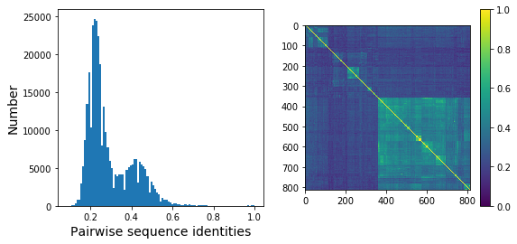
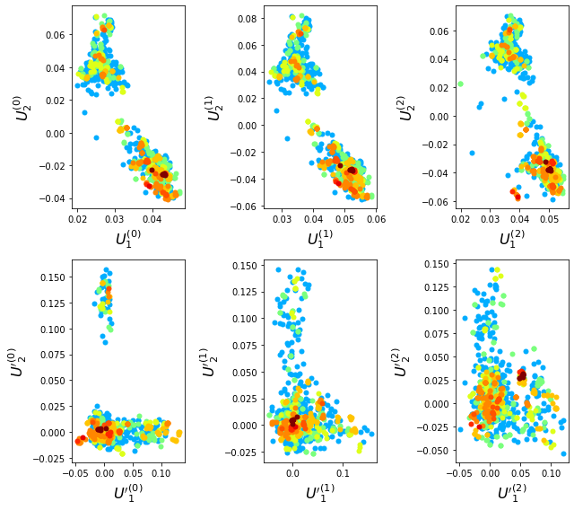
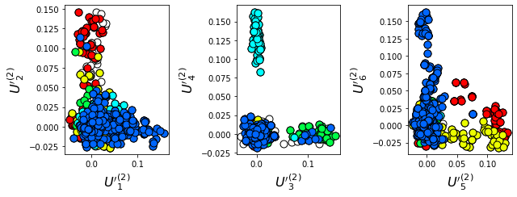
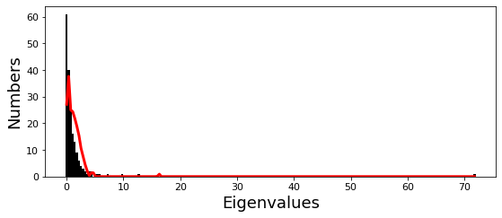
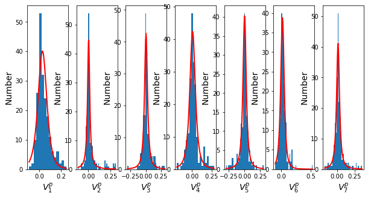
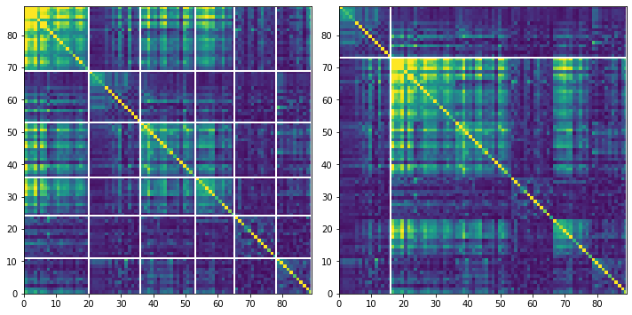
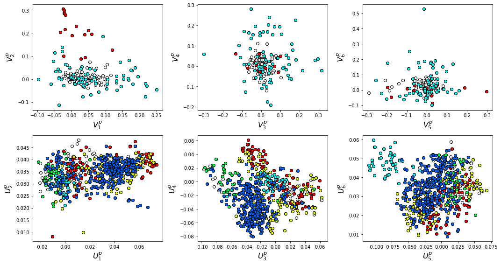
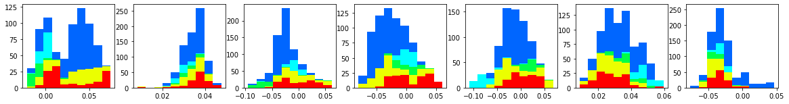

SCA6.0 - The Beta-lactamase enzyme family
-----------------------------------------

This script describes the basic flow of the analytical steps in SCA6.0,
using the :math:`\beta`-lactamase enzyme family as an example (PFAM
PF13354). The alignment contains some subfamily structure (clades of
related sequences) as evidenced in Section 1. We identify two sectors: a
core sector surrounding the active site that is shared across all
sequences, and a more peripheral sector containing groups of residues
that diverge in particular subfamilies. For this tutorial, the core
scripts should be run as follows:

::

   >> ./annotate_pfMSA.py ../data/PF13354_full.txt ../data/PF13354_full.an
   >> ./scaProcessMSA.py ../data/PF13354_full.an -s 1FQG -c A -f 'Escherichia coli'-t -n
   >> ./scaCore.py ../output/PF13354_full.db
   >> ./scaSectorID.py ../output/PF13354_full.db

Note that we supply annotated alignments for all tutorial scripts *(the
annotate_pfMSA step is slow, and should only be run once)*.

**O.Rivoire, K.Reynolds and R.Ranganathan** 9/2014

.. code:: python3

    from __future__ import division
    
    import sys
    sys.path.append('../pysca')
    
    import os
    import time
    import matplotlib.pyplot as plt
    import math
    import numpy as np
    import copy
    import scipy.cluster.hierarchy as sch
    from scipy.stats import scoreatpercentile 
    import scaTools as sca
    import colorsys
    #import mpld3
    import pickle as pickle
    from optparse import OptionParser
    
    if not os.path.exists('../output/'):
        os.makedirs('../output/')
        
    %matplotlib inline

Read in the results of the above three scripts (scaProcessMSA, scaCore
and scaSectorID), stored as three dictionaries in the database
PF13354_full.db. To see what variables are stored in each dictionary,
use:

::

   >>> list(db)

.. code:: python3

    db = pickle.load(open('../output/PF13354_full.db','rb'))
    Dseq = db['sequence']
    Dsca = db['sca']
    Dsect = db['sector']

I. Statistical Structure of the Multiple Sequence Alignment (MSA)
~~~~~~~~~~~~~~~~~~~~~~~~~~~~~~~~~~~~~~~~~~~~~~~~~~~~~~~~~~~~~~~~~

Plot a histogram of all pairwise sequence identities *(left panel)* and
a global view of the sequence similarity matrix (defined by
:math:`S\equiv \frac{1}{L}XX^\top`) *(right panel)*. The data show that
the alignment is described by a nearly bimodal distribution of sequence
identities with peaks near 25% and 45%. From the matrix at right, it is
clear that the alignment is composed of several distinct sequence
families.

.. code:: python3

    # List all elements above the diagonal (i<j):
    listS = [Dsca['simMat'][i,j] for i in range(Dsca['simMat'].shape[0]) \
             for j in range(i+1, Dsca['simMat'].shape[1])]
    
    # Cluster the sequence similarity matrix
    Z = sch.linkage(Dsca['simMat'], method = 'complete', metric = 'cityblock')
    R = sch.dendrogram(Z,no_plot = True)
    ind = R['leaves']

.. code:: python3

    # Plotting
    plt.rcParams['figure.figsize'] = 9, 4 
    
    plt.subplot(121)
    plt.hist(listS, math.floor(Dseq['Npos']/2))
    plt.xlabel('Pairwise sequence identities', fontsize=14)
    plt.ylabel('Number', fontsize=14)
    
    plt.subplot(122)
    plt.imshow(Dsca['simMat'][np.ix_(ind,ind)], vmin=0, vmax=1)
    plt.colorbar()

.. parsed-literal::

    <matplotlib.colorbar.Colorbar at 0x6d17a98b6fd0>

To examine the role of sequence and position weighting on the structure
of the sequence space, we compute correlation matrices between all pairs
of sequences, either with or without sequence and position weights and
project the corresponding sequence space (by eigenvalue decomposition)
down to a small set of top modes that contain the statistically dominant
relationships between sequences. Since eigenvalue decomposition does not
necessarily provide the best representation of sequence groups (for
reasons described in “xx”), we also apply independent components
analysis (or ICA) to the top few eigenmodes; this manipulation provides
a representation in which the top groupings of sequences in the
alignment (if such exists) should separate along the so-called
independent components (or ICs). Below we plot the following eigenmodes
*(top row)* and independent components *(bottom row)*:

:math:`\bullet` :math:`U^{(0)}` and :math:`U'^{(0)}`, the top eigenmodes
and ICs without any weights;

:math:`\bullet` :math:`U^{(1)}` and :math:`U'^{(1)}` the top eigenmodes
and ICs with sequences weights;

:math:`\bullet` :math:`U^{(2)}` and :math:`U'^{(2)}` the top eigenmodes
and ICs with both sequences and positional weights.

The sequences are colored by weight, with red indicating the most
strongly downweighted sequences. In contrast to the g-protein example,
we see that application of the sequence and position weights makes the
sequence space apparently more uniform (removes some of the family or
clade-like structure).

.. code:: python3

    Useq = Dsca['Useq']
    Uica = Dsca['Uica']
    plt.rcParams['figure.figsize'] = 9, 8 
    ica = ["","","","'","'","'"]
    for k,U in enumerate(Useq+Uica):
        plt.subplot(2,3,k+1)
        sca.figWeights(U[:,0], U[:,1], Dseq['seqw'][0])
        plt.xlabel(r'${U%s}^{(%i)}_1$'%(ica[k],k%3), fontsize=16)
        plt.ylabel(r'${U%s}^{(%i)}_2$'%(ica[k],k%3), fontsize=16)
    plt.tight_layout()

To examine the relationship between divergence in *sequence similarity*
and *phylogeny* in the sequence-weighted alignment, we plot the top
independent components of the sequence correlation matrix (after
sequence weighting), colored by phylogenetic group. We start by
constructing a dictionary of phylogenetic annotations and checking the
representation of sequences in the top taxonomic levels. The annotations
are parsed from the sequence headers.

.. code:: python3

    #construct a dictionary of phylogenetic groups
    annot = dict()
    for i, h in enumerate(Dseq['hd']):
        hs = h.split('|')
        annot[hs[0]] = sca.Annot(hs[1], hs[2], hs[3].replace('.',''))
        
    # Most frequent taxonomic groups:
    atleast = 10
    for level in range(4):
        descr_list = [a.taxo.split(',')[level] for a in annot.values() \
                      if len(a.taxo.split(',')) > level]
        descr_dict = {k:descr_list.count(k) for k in descr_list \
                      if descr_list.count(k)>=atleast}
        print('\n Level %i:' % level)
        print(descr_dict)

.. parsed-literal::

    
     Level 0:
    {'Bacteria': 803}
    
     Level 1:
    {'Proteobacteria': 380, 'Actinobacteria': 145, 'Firmicutes': 119, 'Deinococcus-Thermus': 11, 'Bacteroidetes': 46, 'Cyanobacteria': 59, 'Acidobacteria': 10, 'environmental samples': 18}
    
     Level 2:
    {'Gammaproteobacteria': 200, 'Actinobacteridae': 139, 'Bacillales': 55, 'Deinococci': 11, 'Clostridia': 41, 'Betaproteobacteria': 57, 'Chroococcales': 31, 'Alphaproteobacteria': 115, 'Lactobacillales': 12, 'Negativicutes': 11, 'Bacteroidia': 21, 'Nostocales': 10, 'Oscillatoriales': 11}
    
     Level 3:
    {'Enterobacteriales': 89, 'Actinomycetales': 139, 'Paenibacillaceae': 10, 'Clostridiales': 35, 'Burkholderiales': 55, 'Vibrionales': 28, 'Synechococcus': 14, 'Bacillaceae': 31, 'Rhizobiales': 48, 'Pseudomonadales': 28, 'Rhodospirillales': 16, 'Selenomonadales': 11, 'Sphingomonadales': 31, 'Caulobacterales': 10, 'Bacteroidales': 21, 'Thiotrichales': 12, 'Xanthomonadales': 16, 'Rhodobacterales': 10, 'Nostocaceae': 10}

Based on this, we select taxonomic groups and colors for representation.
Here, we just start by choosing the broadly well-represented groups. To
see a complete color-coding legend, use:

::

   >>> sca.figColors()

.. code:: python3

    phylo = list();
    fam_names = ['Firmicutes', 'Actinobacteria', 'Bacteroidetes', \
                 'Cyanobacteria', 'Proteobacteria']
    col = (0, 0.18, 0.38, 0.5, 0.6)
    # Firmicutes = red, Actinobacteria = yellow, Bacteroidetes = cyan, 
    # Cyanobacteria = green, Proteobacteria = blue
    
    for i,k in enumerate(fam_names):
        sf = sca.Unit()
        sf.name = fam_names[i].lower()
        sf.col = col[i]
        sf.items = [j for j,q in enumerate(Dseq['hd'])  if sf.name in q.lower()]
        phylo.append(sf)

Plot the top six independent components of the sequence correlation
matrix (with sequence weights); color-coded by phylogenetic annotation.
The sequences clearly seperate into groups related by phylogeny; the
Proteobacteria *(blue)* seperate out on :math:`U_1`, the Firmicutes
*(red)* seperate out on :math:`U_2`, the Cyanobacteria *(green)*
seperate out on :math:`U_3`, and the Bacteroidetes *(cyan)* seperate out
on :math:`U_5`.

.. code:: python3

    plt.rcParams['figure.figsize'] = 9, 3.5
    U = Dsca['Uica'][1]
    pairs = [[2*i,2*i+1] for i in range(3)]
    for k,[k1,k2] in enumerate(pairs):
        plt.subplot(1,3,k+1)
        sca.figUnits(U[:,k1], U[:,k2], phylo)
        #sca.figUnits(U[:,k1], U[:,k2], subfam)
        plt.xlabel(r"${U'}^{(2)}_{%i}$"%(k1+1), fontsize=16)
        plt.ylabel(r"${U'}^{(2)}_{%i}$"%(k2+1), fontsize=16)
    plt.tight_layout()

II. SCA conservation and coevolution
~~~~~~~~~~~~~~~~~~~~~~~~~~~~~~~~~~~~

Plot the eigenspectrum of the SCA positional coevolution matrix
(:math:`\tilde{C_{ij}}`) *(black bars)* and 10 trials of matrix
randomization for comparison *(red line)*. This graph is used to choose
the number of significant eigenmodes.

.. code:: python3

    plt.rcParams['figure.figsize'] = 9, 3.5 
    hist0, bins = np.histogram(Dsca['Lrand'].flatten(), bins=Dseq['Npos'], \
                               range=(0,Dsect['Lsca'].max()))
    hist1, bins = np.histogram(Dsect['Lsca'], bins=Dseq['Npos'], \
                               range=(0,Dsect['Lsca'].max()))
    plt.bar(bins[:-1], hist1, np.diff(bins),color='k')
    plt.plot(bins[:-1], hist0/Dsca['Ntrials'], 'r', linewidth=3)
    plt.tick_params(labelsize=11)
    plt.xlabel('Eigenvalues', fontsize=18); plt.ylabel('Numbers', fontsize=18);
    print('Number of eigenmodes to keep is %i' %(Dsect['kpos']))

.. parsed-literal::

    Number of eigenmodes to keep is 7

To define the positions with significant contributions each of the
independent components (ICs), we make a empirical fit for each IC to the
t-distribution and select positions with greater than a specified cutoff
on the CDF. We choose :math:`p=0.95` as our cutoff. Note that since some
positions might contribute significantly to more than one IC (and
indication of non-independence of ICs), we apply a simple algorithm to
assign such positions to one IC. Specifically, we assign positions to
the IC with which it has the greatest degree of co-evolution.

The data indicate generally good fits for the top six ICs, and we return
the positions contributing to each IC in a format suitable for cut and
paste into PyMol.

.. code:: python3

    plt.rcParams['figure.figsize'] = 10,5 
    
    Vpica = Dsect['Vpica']
    for k in range(Dsect['kpos']):
        iqr = scoreatpercentile(Vpica[:,k],75) - scoreatpercentile(Vpica[:,k],25)
        binwidth=2*iqr*(len(Vpica)**(-0.33))
        nbins=int(round((max(Vpica[:,k])-min(Vpica[:,k]))/binwidth))
        plt.subplot(1,Dsect['kpos'],k+1)
        h_params = plt.hist(Vpica[:,k], nbins)
        x_dist = np.linspace(min(h_params[1]), max(h_params[1]), num=100)
        plt.plot(x_dist,Dsect['scaled_pd'][k],'r',linewidth = 2)    
        plt.xlabel(r'$V^p_{%i}$'%(k+1), fontsize=14)
        plt.ylabel('Number', fontsize=14)
        
    for n,ipos in enumerate(Dsect['ics']):
        sort_ipos = sorted(ipos.items)
        ats_ipos = ([Dseq['ats'][s] for s in sort_ipos])
        ic_pymol = ('+'.join(ats_ipos))
        print('IC %i is composed of %i positions:' % (n+1,len(ats_ipos)))
        print(ic_pymol + "\n")

.. parsed-literal::

    IC 1 is composed of 20 positions:
    61+65+109+117+125+136+157+164+170+179+180+210+213+229+233+241+247+250+251+255
    
    IC 2 is composed of 16 positions:
    63+70+71+73+91+130+131+132+134+143+156+182+196+226+234+236
    
    IC 3 is composed of 17 positions:
    66+68+102+105+106+107+126+144+145+183+185+199+207+215+216+238+244
    
    IC 4 is composed of 12 positions:
    69+72+123+139+149+151+153+161+162+163+186+193
    
    IC 5 is composed of 0 positions:
    
    
    IC 6 is composed of 13 positions:
    67+85+87+148+160+181+190+200+203+211+221+225+231
    
    IC 7 is composed of 11 positions:
    77+84+101+122+138+220+223+224+232+235+245
    

To define protein sectors, we examine the structure of the SCA
positional correlation matrix with positions contributing to the top
independent components (ICs) ordered by weight *(left panel)*. This
provides a basis to determine/interpret which ICs are truly
statistically independent (defining an independent sector) and which
represent hierarchical breakdowns of one sector.

IC 2 appears more distinct and is considered an independent sector
*(sector 1)*. ICs 1,3,5,and 6 are strongly co-evolving, and should be
combined into one sector. IC 4 also appears to be related to [1,3,5,6]
and the combination of 1,3,4,5,6 makes up sector two. The sectors (2 in
total) are defined accordingly, and in the *right panel*, these
independent components have been re-ordered accordingly to visualize
this decomposition.

.. code:: python3

    # plot the SCA positional correlation matrix, ordered by contribution to the top ICs
    plt.rcParams['figure.figsize'] = 10, 10 
    plt.subplot(121)
    plt.imshow(Dsca['Csca'][np.ix_(Dsect['sortedpos'], Dsect['sortedpos'])], \
               vmin=0, vmax=2,interpolation='none',aspect='equal',\
               extent=[0,sum(Dsect['icsize']),0,sum(Dsect['icsize'])])
    line_index=0
    for i in range(Dsect['kpos']):
        plt.plot([line_index+Dsect['icsize'][i],line_index+Dsect['icsize'][i]],\
                 [0,sum(Dsect['icsize'])],'w', linewidth = 2)
        plt.plot([0,sum(Dsect['icsize'])],[sum(Dsect['icsize'])-line_index,\
                            sum(Dsect['icsize'])-line_index],'w', linewidth = 2)
        line_index += Dsect['icsize'][i] 
    
    #define the new sector groupings - 2 total
    sec_groups = ([1],[0,2,4,5,3,6])
    sectors = list()
    for n,k in enumerate(sec_groups):
        s = sca.Unit()
        all_items = list()
        for i in k: all_items = all_items+Dsect['ics'][i].items
        s.items = all_items
        s.col = (1/len(sec_groups))*n
        sectors.append(s)
    
    # plot the re-ordered matrix
    plt.subplot(122)
    line_index=0
    sortpos = list()
    for s in sectors:
        sortpos.extend(s.items)
    plt.imshow(Dsca['Csca'][np.ix_(sortpos, sortpos)], vmin=0, vmax=2,\
               interpolation='none',aspect='equal',\
               extent=[0,len(sortpos),0,len(sortpos)])
    for s in sectors:
        plt.plot([line_index+len(s.items),line_index+len(s.items)],\
                 [0,len(sortpos)],'w', linewidth = 2)
        plt.plot([0,sum(Dsect['icsize'])],[len(sortpos)-line_index, \
                                           len(sortpos)-line_index],'w', linewidth = 2)
        line_index += len(s.items)
    plt.tight_layout()

Print the sector positions, in a format suitable for pyMol, and create a
pyMol session with the sectors (and decomposition into independent
components) as seperate objects. Structurally, sectors 1+3 form
physically contiguous units, and 2 is less so… this is consistent with
the idea that sector 2/IC4 might be associated with sector 1/ICs1+3+5+6

.. code:: python3

    for i,k in enumerate(sectors):
        sort_ipos = sorted(k.items)
        ats_ipos = ([Dseq['ats'][s] for s in sort_ipos])
        ic_pymol = ('+'.join(ats_ipos))
        print('Sector %i is composed of %i positions:' % (i+1,len(ats_ipos)))
        print(ic_pymol + "\n")
    sca.writePymol('1FQG', sectors, Dsect['ics'], Dseq['ats'], \
                   '../output/PF13354.pml','A', '../data/', 0)  

.. parsed-literal::

    Sector 1 is composed of 16 positions:
    63+70+71+73+91+130+131+132+134+143+156+182+196+226+234+236
    
    Sector 2 is composed of 73 positions:
    61+65+66+67+68+69+72+77+84+85+87+101+102+105+106+107+109+117+122+123+125+126+136+138+139+144+145+148+149+151+153+157+160+161+162+163+164+170+179+180+181+183+185+186+190+193+199+200+203+207+210+211+213+215+216+220+221+223+224+225+229+231+232+233+235+238+241+244+245+247+250+251+255
    

III. The phylogenetic basis of the sector hierarchy
~~~~~~~~~~~~~~~~~~~~~~~~~~~~~~~~~~~~~~~~~~~~~~~~~~~

How does the clear phylogenetic heterogeneity in the MSA influence the
sector definitions? To address this, we take advantage of mathematical
methods for mapping between the space of positional and sequence
correlations, as described in *Rivoire et al*. Using this mapping, we
plot the top :math:`k_{pos}` ICs as 2-D scatter plots with the
corresponding sequence space divergence. The colors for the sequence
space are according to the phylogenetic classifications we chose above.

.. code:: python3

    plt.rcParams['figure.figsize'] = 15,8
    pairs = [ [x, x+1] for x in range(0, len(Dsect['ics'])-1, 2) ]
    for n,[k1,k2] in enumerate(pairs):
        plt.subplot(2,len(pairs),n+1)
        sca.figUnits(Dsect['Vpica'][:,k1], Dsect['Vpica'][:,k2], sectors, dotsize = 6)
        plt.xlabel(r'$V^p_{%i}$' % (k1+1), fontsize=16)
        plt.ylabel(r'$V^p_{%i}$' % (k2+1), fontsize=16)
        plt.subplot(2,len(pairs),n+len(pairs)+1)
        sca.figUnits(Dsect['Upica'][:,k1], Dsect['Upica'][:,k2], phylo, dotsize = 6)
        plt.xlabel(r'$U^p_{%i}$' % (k1+1), fontsize=16)
        plt.ylabel(r'$U^p_{%i}$' % (k2+1), fontsize=16)
    plt.tight_layout()

The interpretation for the two sectors:

**Sector 1** is defined along (:math:`V_2^p`). The sequences along the
corresponding component (:math:`U_2^p`) are homogeneously distributed
with respect to phylogeny, consistent with the notion that this sector
is a property of the entire alignment. Notably, this sector forms the
catalytic core of the Beta-lactamase.

**Sector 2** is composed of ICs 1,3,4 and 5 - and each of these is
associated with some phylogenetic divergence. :math:`V_1^p` splits the
cyanobacteria *(green)* from the proteobacteria *(blue)*, :math:`V_3^p`
seperates the proteobacteria *(blue)* from other sequence families,
:math:`V_5^p` seperates out a subset of the firmicutes *(red)*, and
:math:`V_6^p` is associated with a divergence in the bacteriodetes
*(cyan)*. Sector 2 forms a physically contiguous unit that resembles a
shell around the active site. The decomposition described above suggests
that some functional divergence in beta-lactamse dynamics or regulatory
mechanism across phylogenetic lines may underlie the breakdown of this
sector.

For clarity, we also plot the same data as a stacked bar chart below.

.. code:: python3

    plt.rcParams['figure.figsize'] = 20, 5 
        
    col = list()
    for k in phylo:
        col = col + [colorsys.hsv_to_rgb(k.col,1,1)]
    for k in range(Dsect['kpos']):
        forhist = list()
        for group in phylo:
            forhist.append([Dsect['Upica'][i,k] for i in group.items])
        plt.subplot(2,Dsect['kpos'],k+1)
        plt.hist(forhist, histtype='barstacked',color=col)

This concludes the script.
