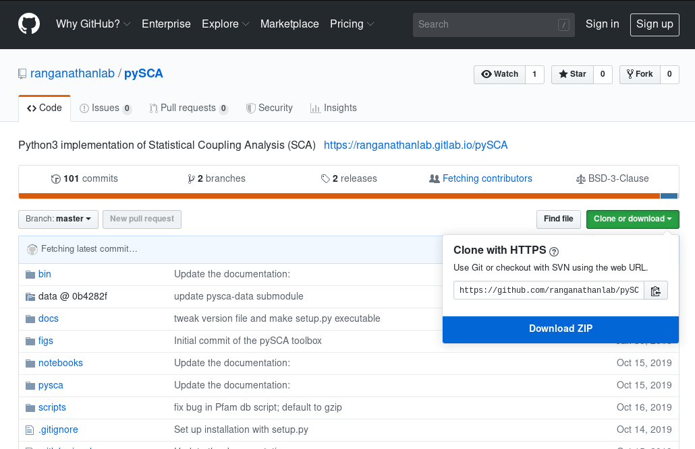

============
Installation
============

The following are a set of command-line-centric instructions for installing
pySCA on Linux, Windows, and macOS operating systems.

1. Install Dependencies
=======================

Choose the set of instructions in this section based on your operating system.

Linux (Ubuntu 18.04)
--------------------

Before installing pySCA, install the following packages from your package
repository:

1) Python 3
2) Pip
3) GCC

.. code-block:: bash
   
   sudo apt-get install python3 python3-pip git gcc

Next, download and install `FASTA
<http://fasta.bioch.virginia.edu/fasta_www2/fasta_down.shtml>`_ from GitHub.
FASTA is needed for the :code:`ggsearch36` function.

.. code-block:: bash

   git clone https://github.com/wrpearson/fasta36.git
   cd fasta36/src
   make -j2 -f ../make/Makefile.linux all
   sudo cp -r ../bin /usr/local
   sudo rm /usr/local/bin/README
   cd ../..

This will compile and install FASTA in the `/usr/local/bin` directory. This
is already on your system PATH, so programs will be able to find it without
additional configuration.

Alternatively, instead of :code:`ggsearch36`, one can instead use the
:code:`needle` function from the `EMBOSS software package
<ftp://emboss.open-bio.org/pub/EMBOSS/>`_.

macOS (10.15)
-------------

To install the dependencies on macOS, you will need to enable Xcode
(:code:`xcode-select --install`) and install `Homebrew <https://brew.sh>`_, and
unofficial package manager.

Xcode may already be enabled, but in case it's not run::

  xcode-select --install

To install Homebrew, run (from the website)::

  /bin/bash -c "$(curl -fsSL https://raw.githubusercontent.com/Homebrew/install/master/install.sh)"

If you run into permissions errors when installing Homebrew, complaining that
root owns the `/usr/local/` directory, you can change the ownership by
running::

  sudo chown -R <user> /usr/local

where `<user>` should be substituted with your username, e.g. `john`.

Once Homebrew is installed, install Python 3 and GCC::

  brew install gcc python3

This will install the most recent version of Python and the GCC compiler in
your `/usr/local` directory. To ensure that these programs are used (rather the
ones packged with the base system), add the following to your shell rc file
(e.g. ~/.bashrc or ~/.zshrc, depending on what your default shell)::

  export CC=/usr/local/bin/gcc-9
  export CXX=/usr/local/bin/g++-9
  alias gcc=/usr/local/bin/gcc-9
  alias g++=/usr/local/bin/g++-9

  alias python=/usr/local/bin/python3
  alias python3=/usr/local/bin/python3
  alias python-pip=/usr/local/bin/python3-pip
  alias python3-pip=/usr/local/bin/python3-pip
  alias python-config=/usr/local/bin/python3-config
  alias python3-config=/usr/local/bin/python3-config

If unsure of your default shell, run :code:`echo $SHELL` in your terminal. To
ensure that the above commands are executed properly, either run :code:`source
~/.bashrc` or :code:`source ~/.zshrc` as appropariate or close and re-open a
terminal. You should see your aliases and environmental variables by running::

  alias
  echo $CC
  echo $CXX

Once the aliases and environmental variables are properly set, install FASTA:

.. code-block:: bash

   git clone https://github.com/wrpearson/fasta36.git
   cd fasta36/src
   make -j2 -f ../make/Makefile.os_x86_64 all
   cp -r ../bin /usr/local
   rm /usr/local/bin/README
   cd ../..

FASTA will now be installed in the `/usr/local/bin` directory, and the
:code:`ggearch` program included in FASTA will now be on the system PATH.

You may need to use :code:`sudo cp -r ../bin /usr/local` and :code:`sudo rm
/usr/local/bin/README` if you run into permissions issues.

Windows 10
----------

First, download and install:
1. `MSYS2 <https://www.msys2.org>`_,
2. `Python 3 <https://www.python.org/downloads/>`_, and
3. `Git for Windows <https://gitforwindows.org/>`_.

**IMPORTANT:** When opening Python 3 installer, click the checkbox to make sure
Python is added to your system PATH. For the rest of the prompts, use the
defaults.

Git for Windows creates both a Bash prompt with Git for version control that
also can access Python 3 installation on the system PATH. Again, it's essential
that Python 3 added there. If not (or if you don't remember), run the Python 3
installer again to make sure.

MSYS2 is a program for compiling Windows programs using a POSIX compatibility
layer and ported versions of GCC, binutils, and other utilities.  Essenailly,
one can use it to compile Windows exe's as one would on a Unix operating
system, like macOS or Linux.

The reason to install it here is to compile FASTA. Once MSYS2 is installed,
open in and run::

  pacman -Syu

The program will upgrade some core packages and request to be closed. Do so,
re-open it, and once again run::

  pacman -Syu

Once the upgrade are complete, install the following packages with the package
manager (:code:`pacman`) by running::

  pacman -S git vim make gcc

Now, you can download and install FASTA::

  git clone https://github.com/wrpearson/fasta36.git
  cd fasta36/src
  make CC=/usr/bin/gcc LD=/usr/bin/ld -j2 -f ../make/Makefile.linux all
  cp -r ../bin /usr/local/
  rm /usr/local/bin/README
  cd ../..

Now, the :code:`ggsearch36` program, along with the others, are installed in
`/usr/local/bin`. The next step is to add this directory into your Windows
system PATH variable:

1. Type 'env' in the start search bar.
2. Click 'Edit the system environment variables'.
3. Click on 'Environment Variables...' toward the bottom of the window that
   opens.
4. Select 'Path' in one of the two selection windows (either 'User variables'
   or 'System variables' is fine)
5. Once 'Path' is highlighted, click 'Edit...'
6. Enter the `/usr/local/bin` as a new PATH entry. You can either:

   - Click 'New' in the new window and enter the path to `/usr/local/bin` in
     the MSYS2 installation folder (default: `C:\msys64\usr\local\bin`).
   - Click the 'Browse...' button and navigate to the `C:\msys64\usr\local\bin`
     directory.

7. When the new entry is added, click 'OK' on all the opened windows to set all
   the changes. You will need to close and re-open terminals for the changes to
   be reflected.

Now, :code:`ggsearch36.exe` will be available to all running programs.

Finally, launch Git Bash (from Git for Windows) after installed. Open the
`~/.bash_profile` file in the text editor, default `vi`, by running :code:`vi
~/.bash_profile`. In this file add the lines::

  alias python="winpty python.exe"
  alias pip="winpty pip.exe"

Close the terminal and open it again. Now, you will be able to invoke the
Python REPL and pip from the Git Bash prompt. Also, if the PATH variable was
properly updated to contain the `/usr/local/bin` folder from the FASTA step,
:code:`ggsearch36.exe` will also be available in Git Bash.

You will use the Git Bash prompt to download and install pySCA.

2. (Optional) Other Dependencies
================================

The following steps are optional but highly recommended:

1) `PFAM annotations
   <ftp://ftp.ebi.ac.uk/pub/databases/Pfam/current_release/database_files/pfamseq.txt.gz>`_ -
   the file `pfamseq.txt` contains phylogenetic annotations for PFAM sequences.
   This is necessary if you would like to annotate PFAM alignments with
   taxonomic/phylogenetic information using the annotateMSA script provided by
   pySCA. The file is available from the PFAM FTP site in compressed (\*.gz)
   format. Just be aware that the file is quite large (~10 Gb download, ~30 Gb
   decompressed), so check beforehand that you have available space on your
   hard drive.

2) `PyMol <https://pymol.org/2/>`_ - necessary if you would like to use pySCA's
   automated structure mapping scripts, and useful for mapping the sectors to
   structure in general.

3) `mpld3 <http://mpld3.github.io/>`_ - a package that allows more
   interactive plot visualization in Jupyter notebooks. If you choose not to
   install this (optional) package, you will need to comment out the
   `import mpld3` lines at the beginning of the tutorials.

3. Download Code
================

The pySCA package, tutorials, and associated scripts are available for download
from the `GitHub repository <https://github.com/ranganathanlab/pySCA>`_. There
are several options for doing so.

A. Use Git
----------

If you have :code:`git` installed on your system, you can use it to clone the
repository from GitHub. Run:

.. code-block:: bash

   git clone https://github.com/ranganathanlab/pySCA.git

For development and troubleshooting purposes, using Git is preferred.

B. (OR) Download from the Website
---------------------------------

Though not recommended, you can also download the source code from the GitHub
website. Click the green "Clone or download" tab pictured below to obtain the
latest code.

In the event that you need older versions of the code, you can use the
`releases <https://github.com/ranganathanlab/pySCA/releases>`_ tab on the
GitHub page to download older tagged version.

4. (OPTIONAL) Modify Settings
=============================

Before installing pySCA, for your convenience, you may specify default paths in
te `settings.py` file for you to use instead of needed to type them out in the
command line. This part is optional, as every path that you can set in this
file can be specified in the command line.

The following variables in the "PATHS" of `settings.py` to reflect the
locations of these files on your computer.

:path2pfamseq: location of the pfamseq text file (default: `data/pfamseq.txt`)

:path2pfamdb: location of the pfamseq SQLite database (default: `data/pfamseq.db`)
              --- the database is generated by the `getPfamDB.sh` script and
              much faster to process than the text file.

:path2structures: location of your PDB structures for analysis (default:
                  `data/`)

:path2output: location of output directory (default: `output/`)

5. Install pySCA (global)
=========================

The analysis scripts found in the bin/ directory and the SCA toolbox in pysca/
can now be installed. To install them system-wide, from the base of the
repository:

.. code-block:: bash

   cd pySCA
   pip install .
   cd ..

Pip will first install python package dependencies:

1) Numpy
2) Scipy
3) Argparse
4) Wheel
5) Matplotlib

Then, it install the pySCA code itself.

In the event you run into permissions errors, two options are to either:

A. Install pySCA Locally
------------------------

To install pySCA in your user directory (and without root privileges), run::

  pip install --user .

Note that to use locally installed scripts, the installation directory needs to
be in the system PATH. To check whether that is the case, run::

  echo $PATH | grep --color=auto "$(python -m site --user-base)/bin"

If the installation directory is highlighted in the output, then the PATH is
configured correctly. If it is not found, then it needs to be added manually.
Open you shell configuration file (e.g. .bashrc) and add the directory to the
PATH variable by appending the following line::

  export PATH="$HOME/.local/bin:$PATH"

The exact path (the text following the semicolon) may differ on your system,
but it can easily be found by running `echo $(python -m site --user-base)/bin`.

B. OR Install pySCA as root
---------------------------

To install pySCA system-wide, run (as root/administrator)::

  sudo pip install .

This will obviate any need to mess around with local PATH variables, and pySCA
will be accessible to all users on the system.

Now, with the pySCA code installed, each of the commands found in bin/ can now
be run from the command line.

6. Getting Started and Running the Tutorials
============================================

The :doc:`"getting started" <get_started>` section of this documentation
provides instructions on how to run some initial calculations and the
tutorials. The basic idea behind the pySCA code is that the core calculations
are performed using a series of executable Python scripts, and then the results
can be loaded and analyzed/visualized using an Jupyter notebook (or
alternatively, MATLAB).

All of the tutorials are written provided as Jupyter notebooks. For more on
how Jupyter notebooks work, see: `<https://jupyter.org>`_. Prior to running the
notebook tutorials, you'll need to run the core calculation scripts that
generate the input for the notebooks. One way to do this is with the shell
script "runAllNBCalcs.sh", and there is more information on this in the
:doc:`"getting started" <get_started>` section. Once the calculations are
completed, you can begin the tutorial in interactive Python from the command
line, by typing:

To install Jupyter, run:

.. code-block:: bash

   pip install jupyterlab

You can then open the notebooks from the command line by running:

.. code-block:: bash

   jupyter notebook <notebook.ipynb>

.. **Important:** The :code:`ggearch36`, :code:`needle`, and :code:`pymol`
.. programs need to be on the system PATH.
..
.. To view your system PATH, run in the terminal::
..
..   echo $PATH
..
.. To add directories containing the required prorams to your system path, you
.. will need to edit your shell configuration file (e.g. `.bashrc` or
.. `.bash_profile`) found at the base of your user directory. To add a directory
.. to the system PATH, open up the file and apped the line::
..
..   export PATH="$PATH:<path to directory>"
..
.. where `<path to directory>` is replaced with the path to the directory
.. containing a program you wish to add (e.g. `~/.local/bin`). After saving the
.. changes, new terminals will use the updated PATH.
..
.. **Important:** To add an already-installed program is to the PATH, run::
..
..   $ whereis <program>
..
.. to find where `<program>` (e.g. :code:`pymol`) is located, and add its
.. directory to the system PATH in the manner described above.
..
.. **Important:** Your requirements will vary depending on the size of your
.. sequence alignments, but as a rule of thumb, the toolbox is best used on a
.. system with at least 8 GB of RAM. pySCA may run with Less, but there will be a
.. greater risk when using modestly-sized multeiple sequence alignments of
.. processes using more memory than available and subsequently getting killed by
.. the operating system's scheduler.
